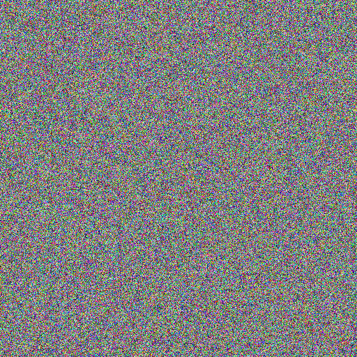
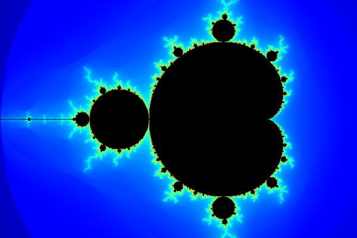
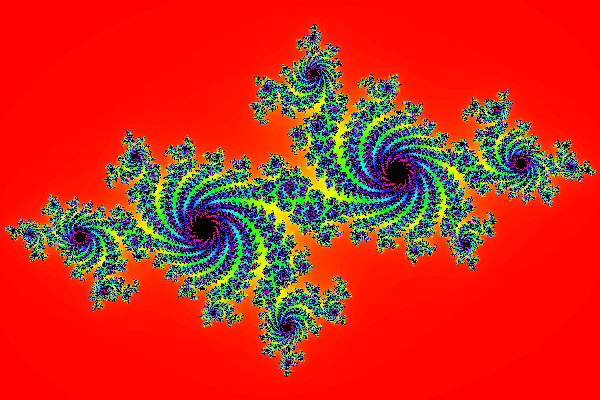

# Bitmap Plus Plus
Simple and Fast header only Bitmap (BMP) library

## Bitmap Type Supported
- 24 Bits Per Pixel

## Examples

<h3>Random Pixel Colors</h3>
<br>
```cpp
#include "BitmapPlusPlus.hpp"

int main(void)
{
	bmp::Bitmap image(512, 512);
	for (std::int32_t y = 0; y < image.Height(); ++y)
	{
		for (std::int32_t x = 0; x < image.Width(); ++x)
		{
			bmp::Pixel color =
			{
				static_cast<std::uint8_t>(std::rand() % 256),
				static_cast<std::uint8_t>(std::rand() % 256),
				static_cast<std::uint8_t>(std::rand() % 256)
			};
			image.Set(x, y, color);
		}
	}
	image.Save("image.bmp");

	return EXIT_SUCCESS;
}
```


<br><br>

<h3>Mandelbrot Fractal Set</h3>
<br>
```cpp
#include "BitmapPlusPlus.hpp"
#include "ColorMaps.inl"

int main(void)
{
    bmp::Bitmap image(600, 400);

    double cr, ci;
    double nextr, nexti;
    double prevr, previ;
    constexpr const std::uint16_t max_iterations = 3000;

    for (std::int32_t y = 0; y < image.Height(); ++y)
    {
        for (std::int32_t x = 0; x < image.Width(); ++x)
        {
            cr = 1.5 * (2.0 * x / image.Width() - 1.0) - 0.5;
            ci = (2.0 * y / image.Height() - 1.0);

            nextr = nexti = 0;
            prevr = previ = 0;

            for (std::uint16_t i = 0; i < max_iterations; ++i)
            {
                prevr = nextr;
                previ = nexti;

                nextr = prevr * prevr - previ * previ + cr;
                nexti = 2 * prevr * previ + ci;

                if (((nextr * nextr) + (nexti * nexti)) > 4)
                {
                    const double z = sqrt(nextr * nextr + nexti * nexti);

                    //https://en.wikipedia.org/wiki/Mandelbrot_set#Continuous_.28smooth.29_coloring
                    const std::uint32_t index = static_cast<std::uint32_t>(1000.0 * log2(1.75 + i - log2(log2(z))) / log2(max_iterations));

                    image.Set(x, y, jet_colormap[index]);

                    break;
                }
            }
        }
    }

    image.Save("mandelbrot.bmp");

    return EXIT_SUCCESS;
}
```


<br><br>

<h3>Julia Fractal Set</h3>
<br>

```cpp
#include "BitmapPlusPlus.hpp"
#include "ColorMaps.inl"

int main(void)
{
    bmp::Bitmap image(600, 400);

    constexpr const std::uint16_t max_iterations = 300;
    
    constexpr const double cr = -0.70000;
    constexpr const double ci = 0.27015;

    double prevr, previ;

    for (std::int32_t y = 0; y < image.Height(); ++y)
    {
        for (std::int32_t x = 0; x < image.Width(); ++x)
        {
            double nextr = 1.5 * (2.0 * x / image.Width() - 1.0);
            double nexti = (2.0 * y / image.Height() - 1.0);

            for (std::uint16_t i = 0; i < max_iterations; ++i)
            {
                prevr = nextr;
                previ = nexti;

                nextr = prevr * prevr - previ * previ + cr;
                nexti = 2 * prevr * previ + ci;

                if (((nextr * nextr) + (nexti * nexti)) > 4)
                {
                    const bmp::Pixel color = hsv_colormap[static_cast<std::size_t>((1000.0 * i) / max_iterations)];
                    image.Set(x, y, color);
                    break;
                }
            }
        }
    }

    image.Save("julia.bmp");

    return EXIT_SUCCESS;
}
```



<br><br>

<h3>Modify Penguin</h3>
<br>

```cpp
#include "BitmapPlusPlus.hpp"

int main(void)
{
	bmp::Bitmap image;
	if (image.Load("penguin.bmp"))
	{
		//Modify loaded image (makes half of the image black)
		for (std::int32_t y = 0; y < image.Height(); ++y)
		{
			for (std::int32_t x = 0; x < image.Width() / 2; ++x)
			{
				image.Set(x, y, bmp::Pixel::Black);
			}
		}
		//Save
		image.Save("modified-penguin.bmp");
	}
	else
		return EXIT_FAILURE; 

	return EXIT_SUCCESS;
}
```


## Features and bugs
If you face any problems feel free to open an issue at the [issue tracker][tracker]. If you feel the library is missing a feature, please raise a ticket on Github. Pull request are also welcome.

[tracker]: https://github.com/BaderEddineOuaich/BitmapPlusPlus/issues


